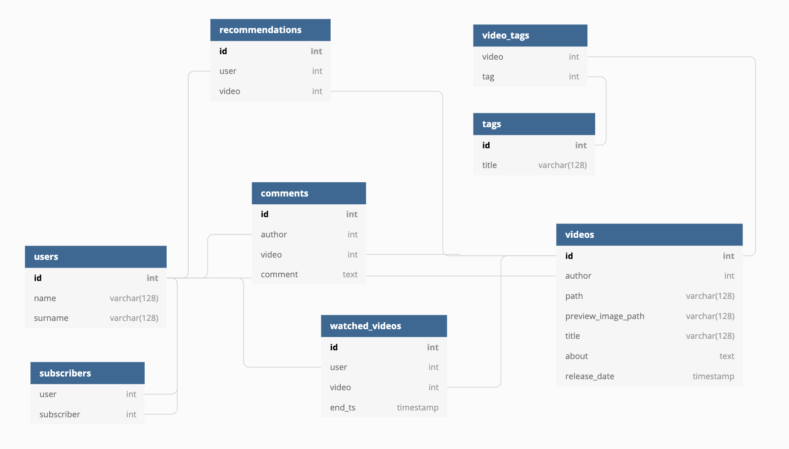
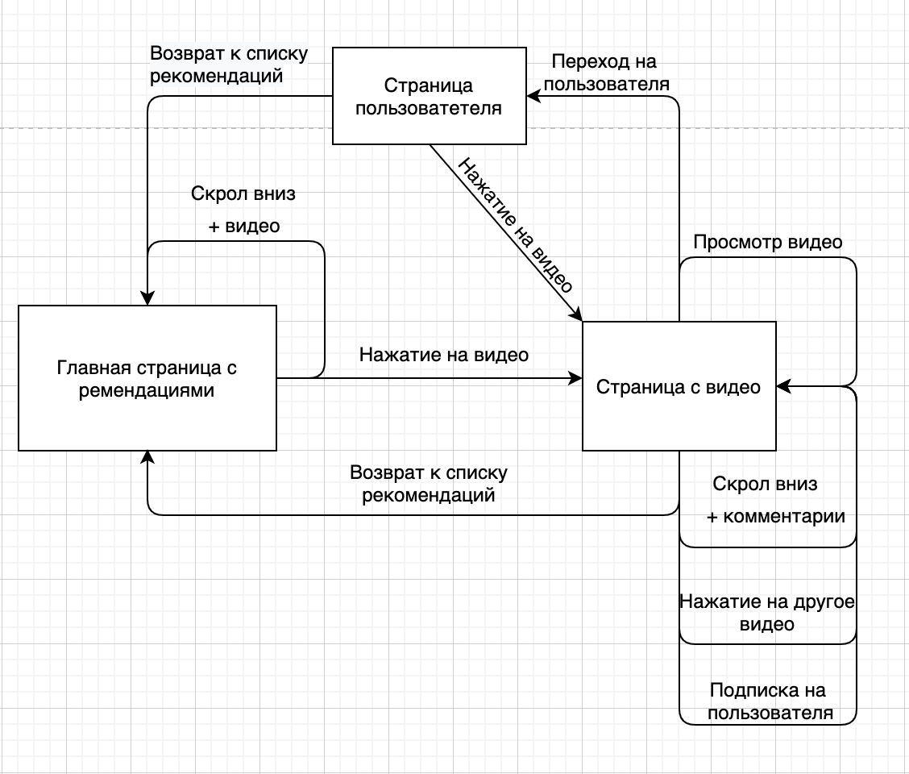
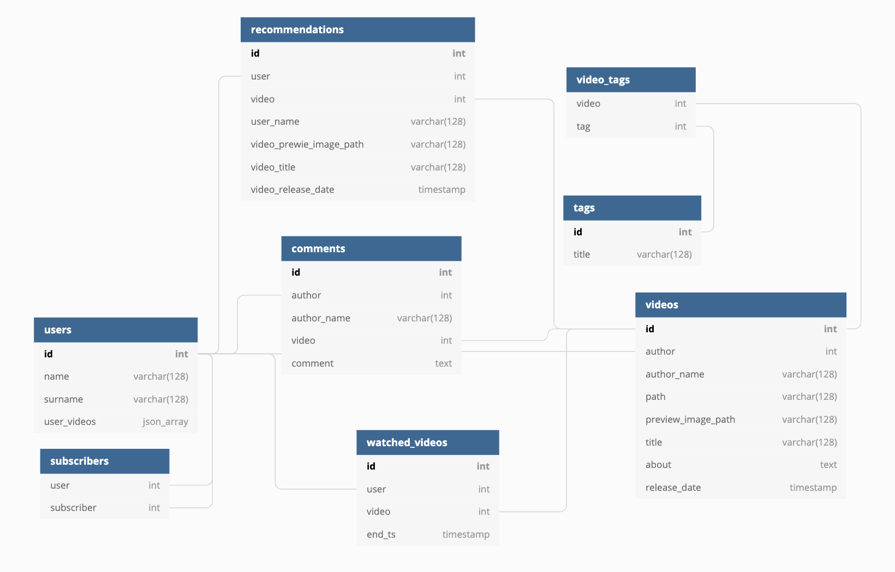
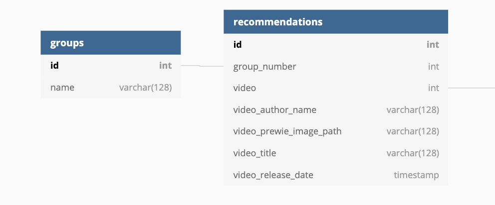

Проект по курсу HighLoad
==========

## Youtube
Российская аудитория YouTube ~ [75млн. чел.](https://webindex.mediascope.net/report?id=88155)
<table>
  <tr>
    <td>12-17 лет</td>
    <td>18-24 года</td>
    <td>25-34 лет</td>
    <td>35-44 года</td>
    <td>44-54 года</td>
    <td>55-56 лет</td>
  </tr>
  <tr>
    <td>10%</td>
    <td>18%</td>
    <td>28%</td>
    <td>20%</td>
    <td>15%</td>
    <td>9%</td>
  </tr>
</table>

MVP функционал
=============
* Загрузка видео
* Отдача видео

# Расчет нагрузки
## Данные:
* Среднее время просмотра YouTube в день ~ [48мин](https://webindex.mediascope.net/report?id=88155)
* Среднее время просмотра видео YouTube ~ [53сек](https://www.cossa.ru/trends/46644/#:~:text=%D0%9D%D0%B5%D1%81%D0%BC%D0%BE%D1%82%D1%80%D1%8F%20%D0%BD%D0%B0%20%D1%82%D0%BE%2C%20%D1%87%D1%82%D0%BE%20%D0%BD%D0%B5%D0%B3%D0%B0%D1%82%D0%B8%D0%B2%D0%BD%D1%8B%D1%85,%D0%B4%D0%BB%D0%B8%D0%BD%D0%B5%20%D1%81%D0%B0%D0%BC%D0%BE%D0%B3%D0%BE%20%D0%B2%D0%B8%D0%B4%D0%B5%D0%BE%201%3A13.)
* Cредняя скорость мобильного интернета в России ~ [24Мбит/сек](https://rspectr.com/novosti/60464/eksperty-izmerili-srednyuyu-skorost-mobilnogo-interneta-v-rossii#:~:text=%D0%98%D0%BD%D1%84%D0%BE%D1%80%D0%BC%D0%B0%D1%86%D0%B8%D0%BE%D0%BD%D0%BD%D0%BE%2D%D0%B0%D0%BD%D0%B0%D0%BB%D0%B8%D1%82%D0%B8%D1%87%D0%B5%D1%81%D0%BA%D0%BE%D0%B5%20%D0%B0%D0%B3%D0%B5%D0%BD%D1%82%D1%81%D1%82%D0%B2%D0%BE%20TelecomDaily%20%D0%BF%D1%80%D0%BE%D0%B2%D0%B5%D1%80%D0%B8%D0%BB%D0%BE,%D0%A0%D0%BE%D1%81%D1%81%D0%B8%D0%B8%20%D1%81%D0%BE%D1%81%D1%82%D0%B0%D0%B2%D0%B8%D0%BB%D0%B0%2024%20%D0%9C%D0%B1%D0%B8%D1%82%2F%D1%81%D0%B5%D0%BA.)
* Для просмотра видео в Full HD скорость интернета должна быть > [8Мбит/сек](https://wifi.kz/articles/skorost-domashnego-interneta-kakaya-ona-dolzhna-byt/#:~:text=%D0%94%D0%BB%D1%8F%20%D0%BF%D1%80%D0%BE%D1%81%D0%BC%D0%BE%D1%82%D1%80%D0%B0%20%D0%B2%D0%B8%D0%B4%D0%B5%D0%BE%20%D0%B2%20%D0%BA%D0%B0%D1%87%D0%B5%D1%81%D1%82%D0%B2%D0%B5,25%20%D0%9C%D0%B1%D0%B8%D1%82%2F%D1%81%D0%B5%D0%BA%20%D0%B8%20%D0%B2%D1%8B%D1%88%D0%B5.)
* Примем, что каждый пользователь смотрит видео в Full HD при 30 кадрах в секунду
  1. Большинство, чаще всего просматриваемого, русскоязычного контента на YouTube имеет максимальное разрешение Full HD 30
  2. Мобильное приложении YouTube поумолчанию имеет настройку в Full HD
* Видео Full HD, 30 FPS, длительностью 90с весит ~ [55МБ](https://yablyk.com/269873-how-much-does-8k-video-weigh-compared-to-4k-and-full-hd/#:~:text=Full%20HD%201080p%20%D0%BF%D1%80%D0%B8%2060,%20%E2%80%93%20752%2C25%20%D0%9C%D0%91.) или 440 Мбит
* Каждую минуту на YouTube загружают [500 часов видео](https://www.oberlo.com/blog/youtube-statistics#:~:text=500%20hours%20of%20video%20are,uploaded%20every%20day%20to%20YouTube.).
* Для расчета пиковой нагрузки предположим, что пик активности приходится на время с 18:00 - 23:00 по МСК. Так как в это время люди возвращются с работы/учебы. Возьмем 3 часовых пояса 0, +2, +4 исходя из того, что в этих часовых поясах живет больше всего человек ~ 70% населения РФ и они более технологически развиты. Нагрузку на загрузку расчитаем из соотношения дневных нагрузок.
   
## Расчитаем: 
* Размер видео просматриваемого пользователем в день: 48мин * 60 * 440 Мбит/ 90сек ~ 14 Гбит/день
* Общий размер видео трафика: 14Гбит * 75,000,000 чел. = 1,050,000,000 Гбит/день = 1,050 Пбит/день
* Расчитаем общее время загружаемых видео из России приняв, что люди, которые загружают видео, нормально распределены по Земле: 500час/мин * 75 млн. чел. / 1000 млн. чел. = 37.5 час
* Расчитам размер загружаемого в минуту в России: 37,5час/мин * 60 * 60 * 440Мбит / 90сек = 660,000 Мбит/мин = 660 Гбит/мин
* Расчитаем размер видео загружаемого в день: 660 Гбит/мин * 60 * 24 = 950,400 Гбит/день = 950.4 Тбит/день
* Пиковая нагрузка на отдачу в секунду: 75,000,000 чел. * 0.7 * 440 Мбит / 90сек = 23,100,000,000 Мбит/сек = 23,100,00 Гбит/сек = 23,100 Тбит/сек
* Пиковая нагрузка на загрузку: 23,100 Тбит/сек / 10 = 2,300Тбит
  
## Получаем:
* Дневная нагрузка:
  * 950.4 Тбит или 950,400 Гбит/день загружаемого трафика в день
  * 1,050 Пбит/день или 1,050,000,000 Гбит/день выгружаемого трафика в день

* Пиковая нагрузка в секунду:
  * 23,100 Тбит/сек или 23,100,00 Гбит/сек на отдачу
  * 2,300 Tбит/сек или 2,300,000 Гбит/сек на загрузку
  


# Схема БД

## Логическая схема базы данных:


## Упрощеный граф взаимодействия:


## Описание отображения основных элементов:
* Карточка видео:
    * Названия видео
    * Фото для превью
    * Имя автора
    * Дата публикации

* Страница видео:
   * Имя автора
   * Название видео
   * Дата публикации
   * Еще видео из рекомендаций

* Страница пользователя:
  * Данные пользователя
  * Видео, которые он опубликовал

* Комментарий:
  * Имя пользователя
  * Текст комментария

## Запросы:
Исходя из графа взаимодействия с сайтом напишем запросы для получения нужной информации из БД. 
> X и Y - внешние параметры

1. Загрузка рекомендаций
    ```
    SELECT U.name, V.id, V.preview_image_path, V.title, V.release_date
    FROM videos AS V INNER JOIN (
      SELECT user, video
      FROM recomendations
      WHERE user = Y
      LIMIT 10 OFFSET X
    ) AS R ON (V.id = R.video) INNER JOIN 
      users AS U ON (V.author = U.id)
    ```
  
2. Переход на страницу видео
    ```
    SELECT U.name, V.title, V.release_date,  V.path
    FROM users AS U INNER JOIN (
      SELECT title, release_date, path, author
      FROM videos
      WHERE id = Y
    ) AS V ON(U.id = V.author);
    ```

3. Переход на пользователя
    #### Пользователь:
    ``` 
    SELECT name, surname
    FROM users
    WHERE id = Y;
    ```

    #### Видео, которые публиковал пользователь:
    ```
    SELECT U.name, V.id, V.preview_image_path, V.title, V.release_date
    FROM videos AS V INNER JOIN (
      SELECT name, id
      FROM users
      WHERE id = Y
    ) AS U ON(V.author = U.id)
    LIMIT 10 OFFSET X;
    ```

4. Загрузка коментариев
    ```
    SELECT U.name, C.comment
    FROM comments AS C INNER JOIN users AS U ON(C.author = U.id)
    WHERE C.video = Y
    LIMIT 10 OFFSET X;
    ```

## Денормализованная схема БД:
  

## Запросы для денормализованной схемы:
1. Загрузка рекомендаций
    ```
    SELECT user_name, video, video_prewie_image_path, video_title, video_release_date
    FROM recomendations
    WHERE user = Y
    LIMIT 10 OFFSET 0
    ```
  
2. Переход на страницу видео
    ```
    SELECT author_name, title, release_date,  path
    FROM videos
    WHERE id = Y
    ```

3. Переход на пользователя
    ``` 
    SELECT name, surname, json_array
    FROM users 
    WHERE id = Y;
    ```

4. Загрузка коментариев
    ```
    SELECT author_name, comment
    FROM comments
    WHERE video = Y;
    LIMIT 10 OFFSET X;
    ```

## Другая реализация
Так как наибольшая часть запросов будет приходится именно 
на получения рекомендаций на главной странице, то тут возможно 
два варианта дейвствий: 
1. Генерация рекомендаций раз в сутки в часы наименьшей нагрузки с сохранением в реалиционной БД 
2. Генерация рекомендаций "на лету", с сохранением в быстрой, возможно in-memory, БД.

В первом случае нам все равно прийдется хранить индекс
смещения в какой-нибудь in-memory БД, чтобы не показывать
пользователю постоянно одни и те же рекомендации.

Во втором же случае врятли получиться генерировать 
рекомендации под каждого пользователя индивидуально, с учетом каждого его действия.

Можно объединить первый и второй вариант таким образом:
Пользователи разбиваются на группы, для каждой группы 
генерируем набор рекомендаций. В процессе взаимодействия юзера с сайтом, перебрасываем его из группы в группу.

Принадлежность пользователя к определенной группе будем хранить
в in-memory базе, а рекомендации в реалиционной базе. 
Сами рекомендации будут генерироваться по расписанию.

Изменим таблицу рекомендаций в нашей реалицинной схеме:


Таблицы: video_tags, tags, watched_videos могут понадобиться для генерации рекомендаций.


## Физическая схема БД
Основой будет реалиционная СУБД Postgress.

Обоснование:
1. Одная из самых быстрых
2. Много NoSQL штук из коробки

In-memory база данных будет Reddis.

Обоснование:
1. Удобная в использовании
2. Поддерживает много прикольных штук из коробки

Сами видео можно хранить в S3, но скорее это экономически не целесообразно.
Поэтому лучше хранить их на своих серверах. Ввиду очень большой нагрузки стоит
использовать SSD т.к. хоть HDD и хорошо работают на последовательное чтение, но из-за большого
количества пользователей головке диска прийдется очень часто перемещаться. 
Поэтому в данном случае нужно выбирать накопители исходя именно из скорости произвольного чтения.
На менее нагруженных серверах можно использовать HDD объединенные в RAID-0 или RAID-5.
Помимо этого стоит использовать CDN для кэширование контента и обеспечения качества для
пользователей, которые находятся далеко от основных серверов.

   

