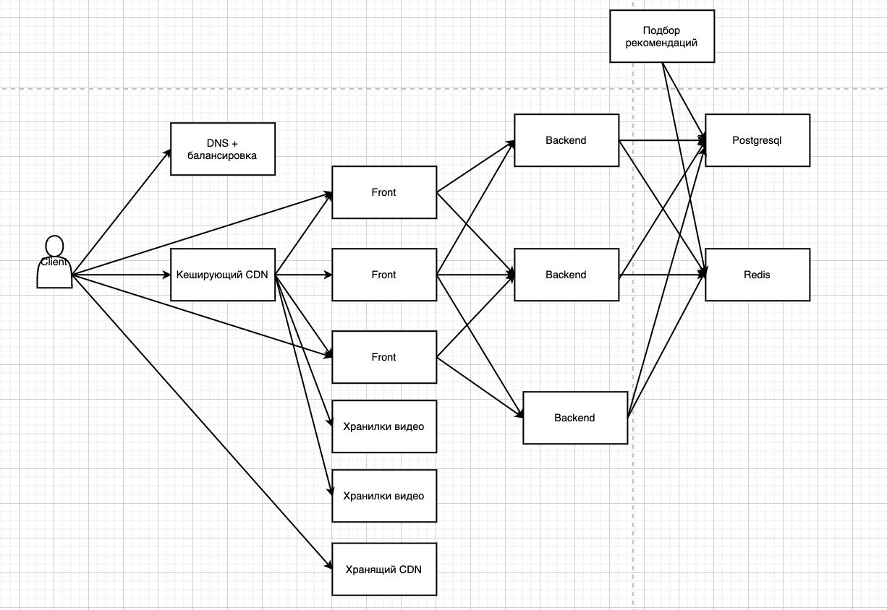

Проект по курсу HighLoad
==========

## Youtube
Российская аудитория YouTube ~ [75млн. чел.](https://webindex.mediascope.net/report?id=88155)
<table>
  <tr>
    <td>12-17 лет</td>
    <td>18-24 года</td>
    <td>25-34 лет</td>
    <td>35-44 года</td>
    <td>44-54 года</td>
    <td>55-56 лет</td>
  </tr>
  <tr>
    <td>10%</td>
    <td>18%</td>
    <td>28%</td>
    <td>20%</td>
    <td>15%</td>
    <td>9%</td>
  </tr>
</table>

MVP функционал
=============
* Загрузка видео
* Отдача видео

# Расчет нагрузки
## Данные:
* Среднее время просмотра YouTube в день ~ [48мин](https://webindex.mediascope.net/report?id=88155) 
* Среднее количество просмотренных видео в день ~ 15
* Cредняя скорость мобильного интернета в России ~ [24Мбит/сек](https://rspectr.com/novosti/60464/eksperty-izmerili-srednyuyu-skorost-mobilnogo-interneta-v-rossii#:~:text=%D0%98%D0%BD%D1%84%D0%BE%D1%80%D0%BC%D0%B0%D1%86%D0%B8%D0%BE%D0%BD%D0%BD%D0%BE%2D%D0%B0%D0%BD%D0%B0%D0%BB%D0%B8%D1%82%D0%B8%D1%87%D0%B5%D1%81%D0%BA%D0%BE%D0%B5%20%D0%B0%D0%B3%D0%B5%D0%BD%D1%82%D1%81%D1%82%D0%B2%D0%BE%20TelecomDaily%20%D0%BF%D1%80%D0%BE%D0%B2%D0%B5%D1%80%D0%B8%D0%BB%D0%BE,%D0%A0%D0%BE%D1%81%D1%81%D0%B8%D0%B8%20%D1%81%D0%BE%D1%81%D1%82%D0%B0%D0%B2%D0%B8%D0%BB%D0%B0%2024%20%D0%9C%D0%B1%D0%B8%D1%82%2F%D1%81%D0%B5%D0%BA.)
* Для просмотра видео в HD скорость интернета должна быть > [5Мбит/сек](https://wifi.kz/articles/skorost-domashnego-interneta-kakaya-ona-dolzhna-byt/#:~:text=%D0%94%D0%BB%D1%8F%20%D0%BF%D1%80%D0%BE%D1%81%D0%BC%D0%BE%D1%82%D1%80%D0%B0%20%D0%B2%D0%B8%D0%B4%D0%B5%D0%BE%20%D0%B2%20%D0%BA%D0%B0%D1%87%D0%B5%D1%81%D1%82%D0%B2%D0%B5,25%20%D0%9C%D0%B1%D0%B8%D1%82%2F%D1%81%D0%B5%D0%BA%20%D0%B8%20%D0%B2%D1%8B%D1%88%D0%B5.)
* Допустим, что каждый пользователь смотрит видео в HD при 30 кадрах в секунду
  1. Большинство чаще всего просматриваемого русскоязычного контента на YouTube имеет максимальное разрешение HD 30.
  2. Мобильное приложении YouTube по умолчанию имеет настройку в Full HD
* Видео Full HD, 30 FPS, длительностью 90 с и весит ~ [55МБ](https://yablyk.com/269873-how-much-does-8k-video-weigh-compared-to-4k-and-full-hd/#:~:text=Full%20HD%201080p%20%D0%BF%D1%80%D0%B8%2060,%20%E2%80%93%20752%2C25%20%D0%9C%D0%91.) или 440 Мбит.
* Каждую минуту на YouTube загружают [500 часов видео](https://www.oberlo.com/blog/youtube-statistics#:~:text=500%20hours%20of%20video%20are,uploaded%20every%20day%20to%20YouTube.).
* Для расчета пиковой нагрузки предположим, что она равна средней дневной нагрузки умноженной на 2. Так как в это время люди возвращаются с работы/учебы. Нагрузку на загрузку рассчитаем из соотношения дневных нагрузок.
* Общее количество запросов расчитаме исходя из того, что пользователь просматривает 15 видео в день, на каждом третьем видео он открывает комментарии, переходит на страницу автора и возвращается на главную страницу. 
* Для расчета пикового RPS возьмем двойной средний дневной RPS.
   
## Рассчитываем: 
* Размер видео просматриваемого пользователем в день: 48мин * 60 * 440 Мбит/ 90сек ~ 14 Гбит/день
* Общий размер видео трафика: 14Гбит * 75,000,000 чел. = 1,050,000,000 Гбит/день = 1,050 Пбит/день
* Рассчитаем общее время загружаемых видео из России, приняв, что люди, которые загружают видео, нормально распределены по Земле: 500 час/мин * 75 млн. чел. / 1000 млн. чел. = 37.5 час
* Рассчитаем размер загружаемого в минуту в России: 37,5 час/мин * 60 * 60 * 440Мбит / 90сек = 660,000 Мбит/мин = 660 Гбит/мин
* Рассчитаем размер видео загружаемого в день: 660 Гбит/мин * 60 * 24 = 950,400 Гбит/день = 950.4 Тбит/день
* Пиковая нагрузка на отдачу в секунду: 2 * 1,050,000,000 Гбит / (24 * 60 * 60) c = 23,200 Гбит/с = 23.2 Тбит/сек
* Пиковая нагрузка на загрузку: 23 Гбит/сек
* Количество запросов в день: (15 + 3 * 5) * 75,000,000 = 2,250,000,000 RPD(запросов в день)
* Пиковый RPS: 2 * 2,250,000,000 R / (24 * 60 * 60) c = 52,000 RPS

  
## Получаем:
* Дневная нагрузка:
  * 950.4 Тбит или 950,400 Гбит/день загружаемого трафика в день
  * 1,050 Пбит/день или 1,050,000,000 Гбит/день выгружаемого трафика в день
  * 2,250,000,000 запросов в день

* Пиковая нагрузка в секунду:
  * 23.2 Тбит/сек или 23,200 Гбит/с Гбит/сек на отдачу
  * 23 Гбит/сек на загрузку
  * 52,000 RPS
  

# Схема БД

## Логическая схема базы данных:


## Упрощенный граф взаимодействия:


## Описание отображения основных элементов:
* Карточка видео:
    * Названия видео
    * Фото для превью
    * Имя автора
    * Дата публикации

* Страница видео:
   * Имя автора
   * Название видео
   * Дата публикации
   * Еще видео из рекомендаций

* Страница пользователя:
  * Данные пользователя
  * Видео, которые он опубликовал

* Комментарий:
  * Имя пользователя
  * Текст комментария

## Запросы:
Исходя из графа взаимодействия с сайтом напишем запросы для получения нужной информации из БД. 
> X и Y - внешние параметры

1. Загрузка рекомендаций
    ```
    SELECT U.name, V.id, V.preview_image_path, V.title, V.release_date
    FROM videos AS V INNER JOIN (
      SELECT user, video
      FROM recommendations
      WHERE user = Y
      LIMIT 10 OFFSET X
    ) AS R ON (V.id = R.video) INNER JOIN 
      users AS U ON (V.author = U.id)
    ```
  
2. Переход на страницу видео
    ```
    SELECT U.name, V.title, V.release_date,  V.path
    FROM users AS U INNER JOIN (
      SELECT title, release_date, path, author
      FROM videos
      WHERE id = Y
    ) AS V ON(U.id = V.author);
    ```

3. Переход на пользователя
    #### Пользователь:
    ``` 
    SELECT name, surname
    FROM users
    WHERE id = Y;
    ```

    #### Видео, которые публиковал пользователь:
    ```
    SELECT U.name, V.id, V.preview_image_path, V.title, V.release_date
    FROM videos AS V INNER JOIN (
      SELECT name, id
      FROM users
      WHERE id = Y
    ) AS U ON(V.author = U.id)
    LIMIT 10 OFFSET X;
    ```

4. Загрузка комментариев
    ```
    SELECT U.name, C.comment
    FROM comments AS C INNER JOIN users AS U ON (C.author = U.id)
    WHERE C.video = Y
    LIMIT 10 OFFSET X;
    ```

## Денормализованная схема БД:
  

## Запросы для денормализованной схемы:
1. Загрузка рекомендаций
    ```
    SELECT user_name, video, video_prewie_image_path, video_title, video_release_date
    FROM recommendations
    WHERE user = Y
    LIMIT 10 OFFSET 0
    ```
  
2. Переход на страницу видео
    ```
    SELECT author_name, title, release_date,  path
    FROM videos
    WHERE id = Y
    ```

3. Переход на пользователя
    ``` 
    SELECT name, surname, json_array
    FROM users 
    WHERE id = Y;
    ```

4. Загрузка комментариев
    ```
    SELECT author_name, comment
    FROM comments
    WHERE video = Y;
    LIMIT 10 OFFSET X;
    ```

## Расчет 

## Другая реализация:
Так как наибольшая часть запросов будет приходиться именно на получение рекомендаций на главной странице, то тут возможно два варианта действий: 
1. Генерация рекомендаций раз в сутки в часы наименьшей нагрузки с сохранением в реалиционной БД 
2. Генерация рекомендаций "на лету", с сохранением в быстрой, возможно in-memory, БД.

В первом случае нам все равно придется хранить индекс смещения в какой-нибудь in-memory БД, чтобы не показывать пользователю постоянно одни и те же рекомендации.

Во втором же случае вряд ли получиться генерировать рекомендации под каждого пользователя индивидуально, с учетом каждого его действия.

Можно объединить первый и второй вариант таким образом:
Пользователи разбиваются на группы, для каждой группы 
генерируем набор рекомендаций. В процессе взаимодействия юзера с сайтом, перебрасываем его из группы в группу.

Принадлежность пользователя к определенной группе будем хранить
в in-memory базе, а рекомендации в реалиционной базе. 
Сами рекомендации будут генерироваться по расписанию.

Изменим таблицу рекомендаций в нашей реалицинной схеме:


Таблицы: video_tags, tags, watched_videos могут понадобиться для генерации рекомендаций.

# Физическая схема БД

## Технологии:
Основой будет реалиционная СУБД Postgress.

Обоснование:
1. Одна из самых быстрых
2. Много NoSQL штук из коробки

In-memory база данных будет Reddis.

Обоснование:
1. Удобная в использовании
2. Поддерживает много прикольных штук из коробки

Сами видео можно хранить в S3, но, скорее всего, это экономически не целесообразно.
Поэтому лучше хранить их на своих серверах. Ввиду очень большой нагрузки стоит
использовать SSD, т.к. хоть HDD и хорошо работают на последовательное чтение, но из-за большого количества пользователей головке диска придется очень часто перемещаться. 
Поэтому в данном случае нужно выбирать накопители, исходя именно из скорости произвольного чтения.
На менее нагруженных серверах можно использовать HDD объединенные в RAID-0 или RAID-5.
Помимо этого,  стоит использовать CDN для кэширования контента и обеспечения качества для пользователей, которые находятся далеко от основных серверов. SSD тоже можно объединять в RAID5 или RAID-10 массивы, но скорее всего мы упремся в пропускную способность сети чем в скорость SSD.
Все таблицы, за исключением таблицы пренадлежности пользователя к конкретной группе, хранятся в postgres. Таблица соответствия пользователя и группы хранится в Redis. Так же в Redis будем хранить информацию о сессиях пользователей.
Так же очень популярный контент можно складывать в IPFS и забирать напрямую с клиента в часы максимальной нагрузки. Сети как IPFS могут выдерживать гораздо большие нагрузки чем любой из существующих датацентров.


## Расчет размера таблиц:
### Расчитаем
* Предоположим, что наш проект работает больше года. За это время в него загрузили 347 Пбит видео или 43 ПБ. Средний размер одного видео равен [4,5мин](https://blog.webartex.ru/prodolzhitelnost-video-kakuyu-dlinu-rolika-vybrat/#:~:text=%D0%92%20YouTube%20%D1%80%D0%BE%D0%BB%D0%B8%D0%BA%D0%B8%20%D0%B4%D0%BB%D0%B8%D1%82%D0%B5%D0%BB%D1%8C%D0%BD%D0%BE%D1%81%D1%82%D1%8C%D1%8E%20%D0%BC%D0%B5%D0%BD%D0%B5%D0%B5,%D1%81%D0%BE%D1%81%D1%82%D0%B0%D0%B2%D0%BB%D1%8F%D0%B5%D1%82%20%D0%BE%D0%BA%D0%BE%D0%BB%D0%BE%204%2C5%20%D0%BC%D0%B8%D0%BD%D1%83%D1%82.), а средний размер видео равен 4,5 Мбит/мин * 440 Мбит/мин = 2 Гбит. Следовательно нам загрузили порядка 173,500,000 видео.
* Средний размер одной записи в таблице videos = 824 Б. При условии, что средний размер описания видео = 300 Б. Отсюда получаем размер таблицы: 824Б * 173,500,000 = 142,964,000,000 Б или 143 ГБ.
* Средний размер одной записи в таблице users = 2,155 Б. При условии, что в среднем каждый пользователь загрузил 2,3 видео. Отсюда получаем размер таблицы: 2,155 Б * 75,000,000 = 161,640,000,000 или 161 ГБ. Размер этой таблицы должен быть больше чем размер таблицы с videos т.к. из-за денормализации все данные из таблицы videos должны храниться так же в таблице users. 
* Средний размер одной записи в таблице comments = 190 Б. При условии, что средний размер комментария 50 Б. Примем среднее количество комментариев под видео = 10. Отсюда получаем размер таблицы: 190 Б * 10 * 173,500,000 = 328,700,000,000 Б или 329 ГБ.
* Размер остальных таблиц << мал в сравнении с users, comments, videos.
* Предположим, что мы генерируем рекомендации на основе 4 параметров, которые имеют 10 состояний каждый, следовательно мы можем создать до 10,000 различных групп. Сумма пользователей по группам не может привышать 75,000,000, следовательно в среднем в одной группе 7,500 пользователей. Хранение этой таблицы будет осуществляться в Redis и ее размер будет = 75,000,000 * 8 Б = 600,000,000 Б или 600 МБ.
* Для хранения сессии пользователя нам понадобится 300 Б. Расчитаем: 75,000,000 * 300 Б = 22,500,000,000 или 22.5 ГБ

### Получаем:
* Общий размер хранящихся видео: 43 ПБ
* Размер таблицы users: 161 ГБ
* Размер таблицы comments: 329 ГБ
* Размер таблицы videos: 143 ГБ
* Размер таблицы принадлежности пользователя к группе: 600 МБ
* Размер таблицы сессий пользователей: 22.5 ГБ
* Общий размер: 
  * Реалиционной БД 700 ГБ, a c учетом 3х лет: 1,778 ГБ при константном количестве пользователей.
  * In-memory БД 22.5 ГБ

## Шардирование и репликации:
Шардирование лучше всего осуществлять исходя из популярности контета. Самый популярный контент класть на более быстрые сервера с SSD, а менее популярный на сервера с HDD RAID массивами. Шардирование БД будет осуществляться по полю id в таблице users также для больших таблиц videos, comments нужно будет применить парционирование по полю id.

Для обеспечения высокой надежности нужно иметь как минимум 3 копии данных для каждого шарда. Redis и Postgress поддерживают Master-slave репликации.

# Расчет оборудования
* Самый популярный контент будет храниться на CDN серверах. Предположим, что его количество 3% от всего контента -> 43 ПБ * 0,03 = 1.29 ПБ или 1,290 ТБ. Из расчета, что самым оптимальным вариантом является SSD диск на 4 ТБ нам понадобится 323 таких диска. Если принять, что пиковая нагрузка за одним видео = 1% от пиковой нагрузки = 23,200 Гбит/сек / 100 = 232 Гбит/с, то нам понадобится как минимум 3 сервера с двумя 50 Гбит/сек карточками, которые будут хранить это видео. Следовательно нам понадобится в 3 раза больше SSD, т.к. нам прийдется хранить 3 экземпляра видео на CDN, если в каждый сервер ставить по 10 SSD, то получится 100 CDN серверов.
* Также весь контент, в том числе популярный будет храниться в "хранилках". Перед хранилками будут стоять кеширующие CDN сервера. На этих серверх будут стоять HDD диски в RAID5. На каждом сервере будет располагаться две 10 Гбит/с карты и 30 дисков по 8 ТБ c учетом RAID. 43,000 ТБ / (20 * 8 ТБ) = 268 серверов, а с учетом 3х копий 804 сервера.
* При расчете 5,000 RPS на бекенд сервер c запасом 20%. 52,000 RPS / 5,000 RPS * 1,2 = 14 бекенд серверов.
* Исходя из того, что не рекомендуется иметь таблицы размером больше 100 ГБ и из расчета 5000 QPS нам понадобится 9 серверов c Postgresql с учетом реплик.
* Для хранения данных в Redis нам понадобится 3 сервера c 64 ГБ оперативной памяти с учетом реплик.

# Схема проекта



